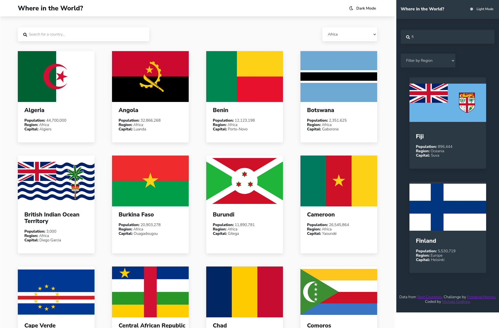
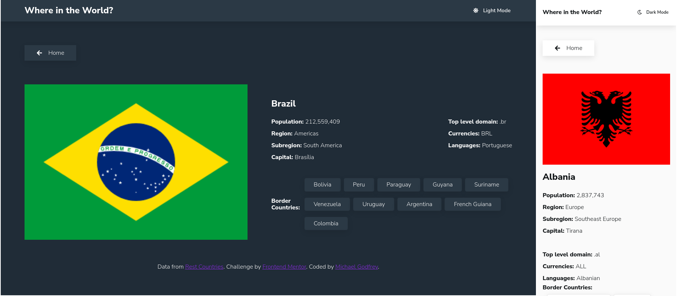

# Frontend Mentor - REST Countries API with color theme switcher solution

This is a solution to the [REST Countries API with color theme switcher challenge on Frontend Mentor](https://www.frontendmentor.io/challenges/rest-countries-api-with-color-theme-switcher-5cacc469fec04111f7b848ca). Frontend Mentor challenges help you improve your coding skills by building realistic projects.

## Table of contents

- [Overview](#overview)
  - [The challenge](#the-challenge)
  - [Screenshot](#screenshot)
  - [Links](#links)
- [My process](#my-process)
  - [Built with](#built-with)
  - [What I learned](#what-i-learned)
  - [Useful resources](#useful-resources)
- [Author](#author)

## Overview

This is the first advanced Frontend Mentor challenge I've completed. The data is provided by [Rest Countries API](https://restcountries.com/) and I used the React library to render the data.

It was good practice of using React to display data from an external API and especicially so with the more subtle aspects, like the country border links.

### The challenge

Users should be able to:

- See all countries from the API on the homepage
- Search for a country using an `input` field
- Filter countries by region
- Click on a country to see more detailed information on a separate page
- Click through to the border countries on the detail page
- Toggle the color scheme between light and dark mode *(optional)*

### Screenshot

Homepage desktop and mobile views with light and dark mode

Country detail desktop and mobile views with light and dark mode

### Links

- Solution URL: [Frontend Mentor Solution](https://www.frontendmentor.io/solutions/where-in-the-world-rest-countries-api-with-react-and-sass-UAvhXazqy8)
- Live Site URL: [live site](https://where-in-the-world-65701.web.app/)

## My process

### Built with

- Sass
- Mobile-first workflow
- [React](https://reactjs.org/) - JS library

### What I learned

I'm pretty happy with the result, although at the time of submitting the project, there are some aspects of React-Router-Dom that I haven't figuted out.

### Useful resources

World map favicon from [favicon.io](https://favicon.io/emoji-favicons/world-map/)

The following packages were used:

- axios
- react-icons

## Author

- Website - [My project showcase](https://michagodfrey.github.io/)
- Frontend Mentor - [@michagodfrey](https://www.frontendmentor.io/profile/michagodfrey)
- Twitter - [@Michael07865192](https://twitter.com/Michael07865192)
